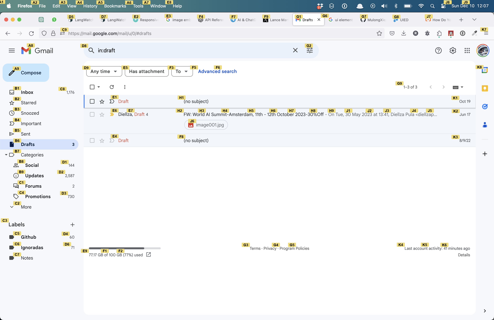

# Driver: GPT-V + OCR Screen Control

This project integrates GPT-V with Google OCR to address the shortcommings of GPT-V in being able to point to something precisely on the screen. As a result, we have an AI that can fully see, understand and interact with your computer screen.

The way it works is by annotating each identified element with a label that GPT-V can use:

| Screenshot                      | Annotated                                           |
| ------------------------------- | --------------------------------------------------- |
|  |  |

## Demo

https://github.com/rogeriochaves/driver/assets/792201/8de94467-393a-487e-b265-46c8b2f4b3b7

[Here is the link to the tweet](https://twitter.com/_rchaves_/status/1734493213199626340)

## Installation

Clone this repo:

```
git clone https://github.com/rogeriochaves/driver.git
```

Install the dependencies:

```
pip install -r requirements.txt
```

Now make a copy of `.env.example` to `.env`, you need to have both OpenAI and Google Cloud API key for Cloud Vision (if you want to contribute, [DM me on twitter](https://twitter.com/_rchaves_) and I can send you a key)

```
GCLOUD_API_KEY=""
OPENAI_API_KEY=""
```

Finally, ask it to do anything you want!

```
python main.py "hey there, please go to my gmail and send an email to Laura with a poem declaring my love"
```

## Contributing

There is A LOT that can be done, the project is very very new so
contributions are very welcome! If you have suggestions for improvements or new features, [open an issue](https://github.com/rogeriochaves/driver/issues), and feel free to fork the repository, make your changes, and submit a pull request.

## License

This project is open-source and available under the MIT License. See the LICENSE file for more details.
